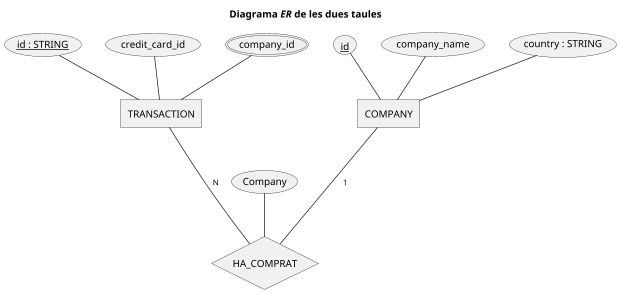

# SPRINT 1 - Task S2.01
##### Manuel López

### _Nocions bàsiques SQL_
[toc]

## Nivell 1
### Exercici 1 - Import databases
Obert ambdós arxius (`estructura_dades.sql` i `dades_introduir.sql`) al MySQL Workbench i executats.

> [!WARNING]
> A l'estructura de dades, la taula `transaction` crea dues **FK**, una per la `company` (`company(id)`) i una altra per una taula inexistent: `credit_card(id)`. Si fos un altre RDBMS com ara PostgreSQL, aquest _script_ donaria un error, per què aquesta taula encara no existeix:
> 
> 
>
> El mateix s'aplica a `user(id)`: la taula `user` no existeix.
> 
> A més, a d'altres motors, el tipus de dada de la columna ha de ser exactament el mateix (en el cas de MySQL / MariaDB, en cas d'un tipus INT, ha de ser de la mateixa longitud i "signe" (SIGNED / UNSIGNED) o donarà error), i aqui tenim que la PK de company és un `VARCHAR(15)` mentre que la columna de la FK a transaction és `VARCHAR(20)`. Com a mínim, planteja una inconsistència de dades ja des del començament.
> 
> Un altre punt seria la inconsistència de la nomenclatura de les dades geogràfiques, utilitzant `lat` per "latitude" i `longitude` per la longitut. Hauria de ser l'un (lat, lng|long|lon) o l'altre (latitude, longitude).
> (O, millor, depenent de l'ús del camp, utilizar el tipus `POINT`).

El primer _script_ crea dues taules amb les seves respectives claus primàries (**PK**), i una clau externa a la taula `transaction` a la columna `company_id` que fa referència a la PK de la taula `company`.




### Exercici 2 - Consultes amb JOIN

> Utilitzant JOIN realitzaràs les següents consultes:
> 
> - Llistat dels països que estan fent compres.
> - Des de quants països es realitzen les compres.
> - Identifica la companyia amb la mitjana més gran de vendes.

#### 2.1. Llistat de països que han comprat

Utilitzo un JOIN des de `transaction` amb `company` extraient el camp `country`. Com aquest es repetix i només vull saber "quins", utilitzo un `SELECT DISTINCT`:

```sql=
SELECT DISTINCT country
  FROM mlg_transactions.`transaction` AS t
  JOIN mlg_transactions.`company`     AS c ON c.id = company_id
 WHERE  NOT declined
```

Filtro per _"NOT declined"_ per què no s'han completat les compres i, per tant, no entrarien dins del domini "han comprat".

El resultat és:

```csvpreview
Canada
Germany
Italy
"United Kingdom"
Sweden
Ireland
"United States"
Norway
France
"New Zealand"
Netherlands
Belgium
Australia
China
Spain
```

:::success
> L'exercici demana una captura de pantalla (sic!):


:::

#### 2.2. Des de quants països es realitzen les compres

Mateixa consulta, només afegint-hi la funció d'agregació `COUNT()` aplicada a la columna anterior:

```sql
SELECT COUNT(DISTINCT country) AS countries
  FROM mlg_transactions.`transaction` AS t
  JOIN mlg_transactions.`company`     AS c ON c.id = company_id
 WHERE  NOT declined
```

S'ha de mantenir el `DISTINCT` ***dintre*** del `COUNT()` per no comptar repetits (si ho treiessim, ens donaria, amb les dades oferides, el total de transaccions no declinades (pel `WHERE`, que serien 500 de 587).

> L'exercici demana una captura de pantalla (sic!):


#### 2.3. Companyia amb la mitjana més gran de vendes

> Si no fos per què "s'entèn" (però no ho especifica: ho hauria de dir a l'enunciat per no crear ambigüitat) que es vol el **nom** de la companyia, no faria falta el JOIN (per això es dedueix que volen el nom de la companyia i no l'ID).

La manera més senzilla és determinar la mitjana de cadascuna i quedar-se només amb la més alta:

```sql
SELECT AVG(amount) AS average
     , company_name
  FROM mlg_transactions.`transaction` AS t
  JOIN mlg_transactions.`company`     AS c ON c.id = company_id
 GROUP BY company_id, company_name
 ORDER BY 1 DESC
 LIMIT 1
```

El resultat és 'Eget Ipsum Ltd' amb una mitjana de `473.075000`.

> L'exercici demana una captura de pantalla (sic!):


### Exercici 3: Utilitzant només subconsultes (sense utilitzar JOIN):

- Mostra totes les transaccions realitzades per empreses d'Alemanya.
- Llista les empreses que han realitzat transaccions per un amount superior a la mitjana de totes les transaccions.
- Eliminaran del sistema les empreses que no tenen transaccions registrades, entrega el llistat d'aquestes empreses.

#### 3.1. Llista tranaccions des d'Alemanya
Seleccionem les transaccions on l'ID de la companyia es correspon amb una llista de les companyies que tenen el camp `country` igual a `Germany`. I no han estat rebutjades. El resultat son 111 tarnsaccions (ho he confirmat and una _query_ feta amb JOIN :wink:).

```sql
SELECT t.*
  FROM mlg_transactions.`transaction` AS t
 WHERE company_id IN (
	SELECT id FROM mlg_transactions.company WHERE country = 'Germany'
)
   AND NOT declined
```

> L'exercici demana una captura de pantalla (sic!):


#### 3.2. Empreses que han realitzat transaccions per una quantitat superior a la mitjana de totes les transaccions

Extreiem el nom del llistat d'empreses que corresponen a la llista (amb DISTINCT) d'empreses amb transaccions (amb èxit!) per un valor superior (sub-query 1^er^ nivell) a la mitjana de totes les transaccions (sub-query 2^n^ nivell).

```sql
-- Empreses que han realitzat transaccions per un valor superior a la mitjana
SELECT company_name
  FROM mlg_transactions.company
 WHERE id IN(
         SELECT DISTINCT company_id
           FROM mlg_transactions.transaction AS t
          WHERE amount > (
                  SELECT AVG(amount)
                    FROM mlg_transactions.`transaction` AS agvt
                )
            AND NOT declined
       )
```

> L'exercici demana una captura de pantalla (sic!):


#### 3.3. Llistat d'empreses sense cap transacció
Extreiem la llista d'empreses a `transaction` i seleccionem les que NO hi son de la taula `company`. El `DISTINCT` no és estrictament necessari, però és costum treballar amb el mínim volum de dades...

```sql
SELECT id
     , company_name
  FROM mlg_transactions.company
 WHERE id  NOT IN(
         SELECT DISTINCT company_id
           FROM mlg_transactions.transaction
       )
```

Quan executem la consulta, observem que

```sql
SELECT DISTINCT company_id
  FROM mlg_transactions.`transaction`
```

ens retorna *totes* les empreses. Per tant, no n'hi ha cap que compleixi els paràmetres.

El resultat, per tant, és `NULL`. O, més concretament, 0 registres.

## Nivell 2

### Exercici 1
> Identifica els cinc dies que es va generar la quantitat més gran d'ingressos a l'empresa per vendes. Mostra la data de cada transacció juntament amb el total de les vendes.

```sql
SELECT DATE(`timestamp`) AS 'Date'
     , SUM(amount)       AS Tot_amount
     , COUNT(company_id) AS Tot_transactions
  FROM mlg_transactions.transaction  AS t
  LEFT JOIN mlg_transactions.company AS c ON c.id = company_id
 GROUP BY DATE(`timestamp`)
 ORDER BY Tot_amount DESC
 LIMIT 5
```

El resultat és:

```
2021-03-29, 1564.87, 4
2021-12-20, 1532.36, 4
2021-06-15, 1469.90, 4
2021-05-09, 1463.73, 5
2021-06-21, 1443.11, 5
```

> L'exercici demana una captura de pantalla (sic!):


### Exercici 2
> Quina és la mitjana de vendes per país? Presenta els resultats ordenats de major a menor mitjà.

```sql
SELECT country
     , AVG(amount)       AS Avg_amount
     , COUNT(company_id) AS Tot_transactions
  FROM mlg_transactions.transaction  AS t
  LEFT JOIN mlg_transactions.company AS c ON c.id = company_id
 GROUP BY country
 ORDER BY Avg_amount DESC
```

### Exercici 3
> En la teva empresa, es planteja un nou projecte per a llançar algunes campanyes publicitàries per a fer competència a la companyia "Non Institute". Per a això, et demanen la llista de totes les transaccions realitzades per empreses que estan situades en el mateix país que aquesta companyia.

Com que estracta de d'analitzar els comportaments de vendes de les empreses, en aquest cas no filtraré les tranaccions rebutjades, ja que podrien tenir algun valor.

#### 3.1. Mostra el llistat aplicant JOIN i subconsultes.
Necessitem el país de l'empresa esmentada:

    SELECT country FROM company WHERE company_name = 'Non Institute'

amb això, podem extreure el llistat d'empreses del mateix país:

```sql
SELECT id
  FROM company
 WHERE country = (
         SELECT country
           FROM company
          WHERE company_name = 'Non Institute'
       )
   AND company_name <>  'Non Institute'
```

I, amb aquest llistat, consultem les transaccions:

```sql
SELECT t.*
  FROM `transaction` AS t
  JOIN `company`     AS c ON c.id = company_id
 WHERE country = (
         SELECT country
           FROM company
          WHERE company_name = 'Non Institute'
       )
   AND company_name <>  'Non Institute'
```

#### 3.2. Mostra el llistat aplicant solament subconsultes.
Amb el mateix raonament del punt anterior, en comptes d'un `JOIN` utilitzem el `SELECT` com a _sub-query_:

```sql
SELECT t.*
  FROM `transaction` AS t
 WHERE company_id IN(
         SELECT id
           FROM company
          WHERE country = (
                  SELECT country
                    FROM company
                   WHERE company_name = 'Non Institute'
                )
            AND company_name <>  'Non Institute'
       )
```

## Nivell 3

### Exercici 1
> Presenta el nom, telèfon, país, data i amount, d'aquelles empreses que van realitzar transaccions amb un valor comprès entre 100 i 200 euros i en alguna d'aquestes dates: 29 d'abril del 2021, 20 de juliol del 2021 i 13 de març del 2022. Ordena els resultats de major a menor quantitat.

Seleccionem les transaccions amb els paràmetres de dates i valors demanats, i hi afegim les dades de les empreses.

```sql=
SELECT company_name      AS nom
     , phone             AS 'telèfon'
     , country           AS 'país'
     , DATE(`timestamp`) AS 'data'
     , amount            AS valor
  FROM mlg_transactions.`transaction` AS t
  JOIN mlg_transactions.company       AS c ON c.id = company_id
 WHERE amount BETWEEN 100.00 AND 200.00
   AND DATE(`timestamp`) IN('2021-04-29', '2021-07-20', '2022-03-13')
 ORDER BY valor DESC
```

Resultat:

| Company | Phone | Country | Date | Amount |
|---|---:|---|:---:|---:|
|Interdum Feugiat Sed Associates | 04 88 40 32 52 | United Kingdom | 2021-07-20 | 164.86|
|Nunc Interdum Incorporated | 05 18 15 48 13 | Germany | 2022-03-13 | 164.32|
|Enim Condimentum Ltd | 09 55 51 66 25 | United Kingdom | 2021-04-29 | 149.89|
|Lorem Eu Incorporated | 01 83 66 62 07 | Canada | 2021-07-20 | 133.39|
|Nunc Interdum Incorporated | 05 18 15 48 13 | Germany  | 2021-04-29 | 111.51|

> L'exercici demana una captura de pantalla (sic!):


### Exercici 2
> Necessitem optimitzar l'assignació dels recursos i dependrà de la capacitat operativa que es requereixi, per la qual cosa et demanen la informació sobre la quantitat de transaccions que realitzen les empreses, però el departament de recursos humans és exigent i vol un llistat de les empreses on especifiquis si tenen més de 4 transaccions o menys.

```sql
SELECT company_name
     , COUNT(t.id)     AS tot_transctions
     , COUNT(t.id) > 4 AS more_than_four
  FROM mlg_transactions.transaction AS t
  JOIN mlg_transactions.company     AS c ON c.id = company_id
 GROUP BY t.company_id, c.company_name
 ORDER BY 2 DESC
```

Resulats:

company_name|tot_transactions|more_than_four
---|---:|:---:
Nunc Interdum Incorporated| 105| 1
Ut Semper Foundation| 59| 1
Enim Condimentum Ltd| 57| 1
Arcu LLP| 56| 1
Lorem Eu Incorporated| 54| 1
Malesuada PC| 52| 1
Non Institute| 30| 1
Fusce Corp.| 2| 0
Convallis In Incorporated| 2| 0
Ante Iaculis Nec Foundation| 2| 0
Donec Ltd| 2| 0
Sed Nunc Ltd| 2| 0
Amet Nulla Donec Corporation| 2| 0
Nascetur Ridiculus Mus Inc.| 2| 0
Vestibulum Lorem PC| 2| 0
Gravida Sagittis LLP| 2| 0
Mus Aenean Eget Foundation| 2| 0
Dis Parturient Institute| 2| 0
Sed LLC| 2| 0
Pretium Neque Corp.| 2| 0
Fringilla LLC| 2| 0
Quisque Libero LLC| 2| 0
Auctor Mauris Vel LLP| 2| 0
Elit Etiam Laoreet Associates| 2| 0
Augue Foundation| 2| 0
Non Magna LLC| 2| 0
A Institute| 2| 0
Quam A Felis Industries| 2| 0
Integer Mollis Corp.| 2| 0
Donec Fringilla PC| 2| 0
Amet Institute| 2| 0
Magna Incorporated| 2| 0
Fringilla Porttitor Incorporated| 2| 0
Aliquet Vel Vulputate Incorporated| 2| 0
Ac Libero Inc.| 2| 0
Ac Industries| 2| 0
Mauris Institute| 2| 0
Non Justo Corp.| 2| 0
Amet Faucibus Ut Foundation| 2| 0
Erat LLP| 2| 0
Neque Tellus Incorporated| 2| 0
Lacus Quisque Associates| 2| 0
Neque Tellus Imperdiet Corp.| 2| 0
Tortor Nunc Commodo Company| 2| 0
Eget Ipsum Ltd| 2| 0
At Pede Corp.| 2| 0
Non Ante LLP| 2| 0
Sed Id Limited| 2| 0
Netus Et Malesuada Ltd| 2| 0
Mauris Id Inc.| 2| 0
Urna Convallis Associates| 2| 0
Pede Cum Ltd| 2| 0
Interdum Feugiat Sed Associates| 2| 0
Tristique Neque Venenatis Institute| 2| 0
Nunc Ac PC| 2| 0
Aliquam Erat Volutpat LLP| 2| 0
Risus Associates| 2| 0
Turpis Company| 2| 0
Justo Eu Arcu Ltd| 2| 0
Eget Tincidunt Dui Institute| 2| 0
Pede Ultrices Ltd| 2| 0
Amet Lorem LLP| 2| 0
Nec Luctus LLC| 2| 0
Mauris Incorporated| 2| 0
Etiam Bibendum Fermentum Industries| 2| 0
Dui Cras Associates| 2| 0
Tincidunt Orci Limited| 2| 0
Nunc Sit Incorporated| 2| 0
Ac Fermentum Incorporated| 2| 0
Metus Vitae Associates| 2| 0
Dolor Vitae Limited| 2| 0
Sapien Nunc Pulvinar LLP| 2| 0
Maecenas Malesuada Fringilla Inc.| 2| 0
Cras Consulting| 2| 0
Aliquet Sem Limited| 2| 0
Magna A Neque Industries| 2| 0
Amet Luctus Vulputate Foundation| 2| 0
Tincidunt Associates| 2| 0
Mattis Foundation| 2| 0
At Associates| 2| 0
Nunc In Foundation| 2| 0
Lorem Ipsum Dolor Corp.| 2| 0
Auctor Mauris Corp.| 2| 0
Cras Vehicula Aliquet Industries| 2| 0
Nulla Integer Vulputate Corp.| 2| 0
Dictum Eu Corp.| 2| 0
Aliquam PC| 2| 0
Viverra Donec Foundation| 2| 0
Orci Adipiscing Limited| 1| 0
Dui Quis Institute| 1| 0
Nibh Phasellus Corporation| 1| 0
Tempor Diam Institute| 1| 0
Euismod Mauris Institute| 1| 0
Et Magnis Ltd| 1| 0
Aliquam Iaculis Lacus Corp.| 1| 0
Placerat LLP| 1| 0
Sed Est Corp.| 1| 0
Egestas Nunc Sed Limited| 1| 0
Rutrum Non Inc.| 1| 0
Aliquet Diam Limited| 1| 0

> L'exercici demana una captura de pantalla (sic!):

