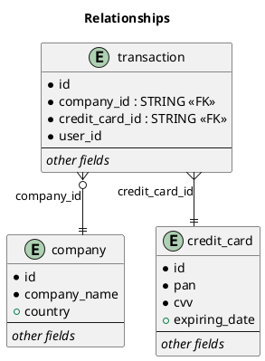
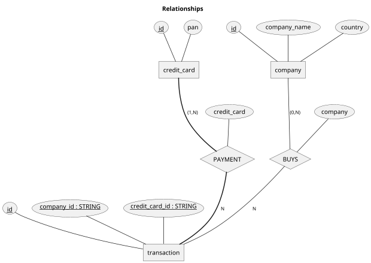

# SPRINT 3 - Task S3.01

## Nivell 1
### Exercici 1
> La teva tasca és dissenyar i crear una taula anomenada "credit_card" que emmagatzemi detalls crucials sobre les targetes de crèdit. La nova taula ha de ser capaç d'identificar de manera única cada targeta i establir una relació adequada amb les altres dues taules ("transaction" i "company"). Després de crear la taula serà necessari que ingressis la informació del document denominat "dades_introduir_credit". Recorda mostrar el diagrama i realitzar una breu descripció d'aquest.

Encara que es podria utilitzar el nº de targeta (el codi de 16 dígits) com a clau primària, prefereixo utilitzar un 'AUTO_INCREMENT' clàssic. Hi ha diferents motius:

1. seria necessàriament de tipus STRING (CHAR(16), CHAR(19), VARCHAR(19)), ineficient
2. en alguns (pocs) casos, noves targetes tenen **el mateix** número, canviant la caducitat i el CVC, per tant, una nova targeta podria tenir el mateix ID
3. seguint el motiu anterior, el propi camp del codi de la targeta no pot ser `UNIQUE`
4. finalment, sembla que les dades proposen utilitzar un codi amb un format específic, que, curiosament, limita a 10000 el nombre de targetes que es poden enmagatzemar
5. A la taula `transaction`, la columna credit_card_id té 15 caràcters de longitut... També és inconsistent. La lògica diu que s'hauria d'utilitzar el màxim valor possible; podem crear la taula `credit_card` amb una columna ID de 15 caràcters o alterar la taula `transaction` per què tingui 8 espais...

Un altre detall és que a les dades, la data d'expiració da la targeta està com a data (d/m/y), però les targetes informen de la seva expiració només amb mes i any, deixant el dia com a l'últim dia del mes informat. No seia correcte utilitzar aquest camp així.

Les dades a introduir diuen quins són els camps i llurs característiques, així que:

```sql
CREATE TABLE IF NOT EXISTS credit_card (
    credit_card_id INT(11)     PRIMARY KEY AUTO_INCREMENT,
    id             VARCHAR(15) UNIQUE,
    iban           VARCHAR(80) NOT NULL COMMENT 'Company should not have this information...',
    pan            VARCHAR(19) NOT NULL COMMENT 'CC number length 15-19',
    pin            INT(2)      NOT NULL COMMENT 'should never save this information',
    cvv            INT(2)      NOT NULL,
    expiring_date  VARCHAR(8)  NOT NULL COMMENT 'Should be just month/year like 04/31 or 04/2031 with length of 5 o 7 characters',
    KEY cc_id (id) COMMENT '_Original_ id'
);
```

Quant a la relació entre les taules, credit_card és una taula referenciada, i per tant, no necessita cap FK (_foreign key_). Podria ser que tingués una relació 1..n amb company o amb user, però ja es veurà i es faran les modificacions, si s'escauen.




O, com a diagrama ER:




#### Execució:


Com que ha donat una advertència sobre l'ús de l'amplada del INT (`INT(m)`), he modificat l'script per utilitzar els sinònims més adeqüats:

```sql
DROP TABLE IF EXISTS credit_card;

CREATE TABLE IF NOT EXISTS credit_card (
    credit_card_id SERIAL            PRIMARY KEY AUTO_INCREMENT,
    id             VARCHAR(15)       UNIQUE,
    iban           VARCHAR(80)       NOT NULL COMMENT 'Company should not have this information...',
    pan            VARCHAR(19)       NOT NULL COMMENT 'CC number length 15-19',
    pin            SMALLINT ZEROFILL NOT NULL COMMENT 'should never save this information',
    cvv            SMALLINT UNSIGNED NOT NULL,
    expiring_date  VARCHAR(8)        NOT NULL COMMENT 'Should be just month/year like 04/31 or 04/2031 with length of 5 o 7 characters',
    KEY cc_id (id) COMMENT '_Original_ id'
);
```

I ja no hi ha cap _warning_:


I l'execució dels `INSERT` hauria d'anar bé:


### Exercici 2
> El departament de Recursos Humans ha identificat un error en el número de compte de l'usuari amb ID CcU-2938. La informació que ha de mostrar-se per a aquest registre és: R323456312213576817699999. Recorda mostrar que el canvi es va realitzar.

```sql
SELECT * FROM credit_card WHERE id = 'CcU-2938';

UPDATE credit_card
   SET iban = 'R323456312213576817699999'
 WHERE id   = 'CcU-2938'
```

Amb el SELECT confirmem que existeix el registre a ser modificat:


I així, executem l'`UPDATE` i executem novament el `SELECT` per confirmar que ha anat bé:


> [!TIP]
> En un ambient de producció es faria amb una seqüència `BEGIN` - `UPDATE` - `SELECT` - `COMMIT`, per evitar perills.

### Exercici 3
> En la taula "transaction" ingressa un nou usuari amb la següent informació:

| Id               | 108B1D1D-5B23-A76C-55EF-C568E49A99DD |
| ---------------- | ------------------------------------ |
| credit\_card\_id | CcU-9999                             |
| company_id       | b-9999                               |
| user_id          | 9999                                 |
| lat              | 829.999                              |
| longitude        | -117.999                             |
| amount           | 111.11                               |
| declined         | 0                                    |

Hi veig un problema: company_id és una FK, i ho hi ha cap empresa amb l'ID que posa aquí (`b-9999`). Amb això, el DML següent, que seria el necessari per inserir el registre:

```sql
INSERT INTO transaction (
    id,
    credit_card_id,
    company_id,
    user_id,
    lat,
    longitude,
    amount,
    declined
) VALUES (
    '108B1D1D-5B23-A76C-55EF-C568E49A99DD',
    'CcU-9999',
    'b-9999',
    '9999',
    829.999,
    -117.999,
    111.11,
    0
);

-- o, sense tantes línies:
INSERT INTO transaction (
    id,
    credit_card_id, company_id, user_id, lat, longitude, amount, declined
) VALUES (
    '108B1D1D-5B23-A76C-55EF-C568E49A99DD',
    'CcU-9999',     'b-9999',    '9999', 829.999,  -117.999, 111.11, 0
);
```

dóna error. Per tant, s'hauria d'inserir primer l'empresa amb l'ID que es vol utilitzar aqui abans, així com la targeta `Ccu-9999`. La petició es retornaria a qui sigui que hagi demanat la inserció per què donessin d'alta l'empresa al sistema (i el seu mètode de pagament, que estaria associat a un usuari que tampoc existeix) abans.

#### Utilizant dades falses
També es por inserir un registre amb dades falses a la taula `company` i a la taula `credit_card` i així poder inserir les dades.No seria l'opció més recomenable. De fet, s'hauria d'evitar.

```sql
INSERT INTO company VALUES (
    'b-9999', '<SENSE NOM>', '<SENSE TELEFON>', '<SENSE EMAIL>', '<PAIS DESCONEGUT>'
);
INSERT INTO credit_card VALUES (
    DEFAULT, 'CcU-9999', '<IBAN DESCONEGUT>', '0000', '000', '0000-00-00', NULL
);
INSERT INTO `user` VALUES (
    '9999', 'NO-NAME', 'NO-SURNAME', '<NO-PHONE>', '<NO-EMAIL>', NULL, NULL, NULL, NULL, NULL
);
```

En una base de dades real, on s'espera que les dades siguin consistents, aquests `INSERT` no funcionarien, serien rebutjats per _constraints_ que revisarien la validesa de les dades (telèfons només dígits i '+', IBAN amb dues lletres i després només dígits, etc.).


### Exercici 4
> Des de recursos humans et sol·liciten eliminar la columna "pan" de la taula credit_*card. Recorda mostrar el canvi realitzat.

```sql
ALTER TABLE credit_card
       DROP COLUMN pan;
```


## Nivell 2
### Exercici 1
> Elimina de la taula transaction el registre amb ID 02C6201E-D90A-1859-B4EE-88D2986D3B02 de la base de dades.

```sql
DELETE
  FROM transaction
 WHERE id = '02C6201E-D90A-1859-B4EE-88D2986D3B02';
```


### Exercici 2
> La secció de màrqueting desitja tenir accés a informació específica per a realitzar anàlisi i estratègies efectives. S'ha sol·licitat crear una vista que proporcioni detalls clau sobre les companyies i les seves transaccions. Serà necessària que creïs una vista anomenada VistaMarketing que contingui la següent informació: Nom de la companyia. Telèfon de contacte. País de residència. Mitjana de compra realitzat per cada companyia. Presenta la vista creada, ordenant les dades de major a menor mitjana de compra.

```sql
CREATE OR REPLACE VIEW VistaMarketing AS
       SELECT c.company_name AS 'Nom de la companyia'
            , c.phone        AS 'Telèfon'
            , c.country      AS 'País'
            , (SELECT ROUND(AVG(amount), 2)
                 FROM `transaction` AS sT
                WHERE sT.company_id = c.id) AS 'Mitjana de compres'
         FROM company AS c;

-- Show the view ordered by the average
SELECT * FROM vistamarketing ORDER BY 4 DESC;
SELECT * FROM vistamarketing ORDER BY `Mitjana de compres` DESC; -- alternate
```

Resultats:


```csv
Nom de la companyia,Telèfon,País,Mitjana de compres
Eget Ipsum Ltd, 03 67 44 56 72, United States, 473.08
Non Magna LLC, 06 71 73 13 17, United Kingdom, 468.35
Sed Id Limited, 07 28 18 18 13, United States, 461.21
Justo Eu Arcu Ltd, 08 42 56 71 52, Italy, 443.64
Eget Tincidunt Dui Institute, 05 35 93 32 44, Netherlands, 442.52
Viverra Donec Foundation, 03 33 12 32 73, United Kingdom, 442.28
Vestibulum Lorem PC, 02 02 87 33 40, Belgium, 434.06
Aliquet Diam Limited, 02 76 61 47 46, United States, 425.64
Maecenas Malesuada Fringilla Inc., 09 38 53 76 61, Netherlands, 408.62
Non Ante LLP, 08 89 47 65 08, Sweden, 407.79
Egestas Nunc Sed Limited, 06 01 02 70 47, Italy, 406.11
Nunc Sit Incorporated, 07 28 42 63 63, Norway, 405.36
Magna A Neque Industries, 04 14 44 64 62, Australia, 396.32
Amet Luctus Vulputate Foundation, 03 18 54 24 19, Canada, 390.33
Aliquam PC, 01 45 73 52 16, Germany, 385.27
Neque Tellus Incorporated, 04 43 18 34 19, Ireland, 364.01
Placerat LLP, 05 43 67 24 41, Netherlands, 357.08
Elit Etiam Laoreet Associates, 07 69 74 17 45, Canada, 351.84
Fusce Corp., 08 14 97 58 85, United States, 350.13
Sapien Nunc Pulvinar LLP, 08 37 12 58 11, New Zealand, 349.66
Mauris Institute, 05 29 60 36 87, Sweden, 346.88
Tincidunt Orci Limited, 01 78 18 81 44, Norway, 326.86
Netus Et Malesuada Ltd, 02 55 43 68 46, Netherlands, 325.34
Dictum Eu Corp., 03 04 73 67 31, Canada, 318.65
Et Magnis Ltd, 03 53 76 11 76, Belgium, 316.74
Gravida Sagittis LLP, 03 81 28 33 97, Sweden, 309.45
Pede Cum Ltd, 07 62 26 48 38, Norway, 301.55
Non Institute, 06 77 15 31 14, United Kingdom, 297.04
Interdum Feugiat Sed Associates, 04 88 40 32 52, United Kingdom, 293.46
Lacus Quisque Associates, 06 26 86 55 77, United States, 293.06
At Pede Corp., 06 14 48 33 15, Italy, 290.37
Fringilla Porttitor Incorporated, 06 30 30 97 81, Sweden, 289.96
Ac Industries, 09 34 65 40 60, Germany, 289.65
Nibh Phasellus Corporation, 08 48 67 57 48, China, 289.04
Malesuada PC, 01 74 85 68 70, Ireland, 288.73
Tortor Nunc Commodo Company, 05 35 92 77 16, United States, 281.96
Ut Semper Foundation, 01 60 36 33 06, Sweden, 273.73
Rutrum Non Inc., 02 66 31 61 09, Germany, 266.90
Lorem Eu Incorporated, 01 83 66 62 07, Canada, 264.46
Mauris Id Inc., 04 83 24 50 85, Ireland, 263.62
Magna Incorporated, 07 73 69 44 18, New Zealand, 258.13
Mattis Foundation, 06 74 03 95 74, Australia, 257.64
Enim Condimentum Ltd, 09 55 51 66 25, United Kingdom, 256.42
Arcu LLP, 06 46 04 41 45, Norway, 252.07
Lorem Ipsum Dolor Corp., 09 03 14 76 02, Sweden, 249.44
Nunc Interdum Incorporated, 05 18 15 48 13, Germany, 244.03
Quam A Felis Industries, 04 87 10 27 16, Italy, 242.95
Urna Convallis Associates, 06 01 24 77 04, United States, 241.16
Augue Foundation, 06 88 43 15 63, Germany, 240.80
Mus Aenean Eget Foundation, 06 25 15 52 43, Sweden, 235.87
Erat LLP, 03 18 88 77 79, Netherlands, 234.84
Euismod Mauris Institute, 02 13 69 54 85, Belgium, 233.45
Aliquet Sem Limited, 03 75 57 02 01, Netherlands, 233.06
Donec Fringilla PC, 01 51 58 14 44, France, 231.59
Amet Institute, 06 33 40 21 33, Australia, 229.82
Turpis Company, 09 69 48 65 52, Netherlands, 225.06
Sed LLC, 01 63 16 26 52, Belgium, 225.00
Risus Associates, 04 25 82 54 31, Australia, 223.35
Sed Nunc Ltd, 02 62 64 73 48, United Kingdom, 221.90
Ante Iaculis Nec Foundation, 08 23 04 99 53, New Zealand, 217.67
Mauris Incorporated, 06 84 33 15 97, Norway, 213.70
Ac Fermentum Incorporated, 06 85 56 52 33, Germany, 206.47
Donec Ltd, 01 25 51 37 37, Norway, 203.72
Quisque Libero LLC, 01 45 48 71 11, China, 196.82
Metus Vitae Associates, 08 25 44 40 66, Australia, 195.28
Fringilla LLC, 08 29 15 93 57, New Zealand, 191.06
A Institute, 03 34 91 68 65, Belgium, 185.96
At Associates, 09 56 61 10 65, New Zealand, 184.41
Auctor Mauris Corp., 05 62 87 14 41, Germany, 184.31
Neque Tellus Imperdiet Corp., 09 15 42 22 11, Ireland, 183.90
Amet Faucibus Ut Foundation, 03 21 62 47 12, United Kingdom, 182.59
Etiam Bibendum Fermentum Industries, 07 46 69 45 02, France, 177.44
Pede Ultrices Ltd, 04 52 40 26 17, Belgium, 171.09
Nascetur Ridiculus Mus Inc., 06 26 87 61 84, United States, 170.82
Cras Vehicula Aliquet Industries, 03 37 86 87 75, Netherlands, 169.96
Dis Parturient Institute, 05 36 29 78 74, Ireland, 164.30
Convallis In Incorporated, 06 66 57 29 50, Germany, 156.73
Integer Mollis Corp., 03 12 20 45 24, Italy, 152.23
Tristique Neque Venenatis Institute, 04 34 85 12 85, Sweden, 148.15
Cras Consulting, 07 50 10 85 63, Belgium, 145.67
Amet Nulla Donec Corporation, 07 15 25 14 74, Italy, 145.13
Auctor Mauris Vel LLP, 08 09 28 74 14, United States, 143.80
Nec Luctus LLC, 02 14 71 75 73, Norway, 134.16
Dolor Vitae Limited, 06 53 60 43 60, France, 128.57
Nunc In Foundation, 03 79 81 18 92, Italy, 120.44
Tincidunt Associates, 09 82 63 76 61, Ireland, 113.78
Orci Adipiscing Limited, 03 18 00 77 81, United Kingdom, 111.64
Ac Libero Inc., 04 36 20 64 29, United Kingdom, 108.55
Non Justo Corp., 09 30 54 14 44, Sweden, 100.71
Aliquam Iaculis Lacus Corp., 04 43 07 91 26, Belgium, 92.18
Pretium Neque Corp., 07 77 48 55 28, Australia, 89.93
Dui Cras Associates, 08 12 73 87 84, Italy, 88.04
Nunc Ac PC, 03 53 62 76 95, Sweden, 70.55
Nulla Integer Vulputate Corp., 04 57 50 84 48, Sweden, 60.40
Amet Lorem LLP, 05 47 44 68 02, Spain, 53.40
Sed Est Corp., 04 58 02 37 91, Canada, 46.25
Tempor Diam Institute, 05 01 94 80 87, Netherlands, 45.36
Dui Quis Institute, 06 93 28 72 81, New Zealand, 43.22
Aliquet Vel Vulputate Incorporated, 04 40 43 84 18, Netherlands, 36.55
Aliquam Erat Volutpat LLP, 06 01 63 57 66, Italy, 27.67

```

### Exercici 3
> Filtra la vista VistaMarketing per a mostrar només les companyies que tenen el seu país de residència en "Germany"

Asumeixo que encara es vol de major a menor mitjana...

```sql
SELECT *
  FROM vistamarketing
 WHERE `País` = 'Germany'
  ORDER BY `Mitjana de compres` DESC; -- alternate
```

Resultats:

```csv
Nom de la companyia,Telèfon,País,Mitjana de compres
Aliquam PC, 01 45 73 52 16, Germany, 385.27
Ac Industries, 09 34 65 40 60, Germany, 289.65
Rutrum Non Inc., 02 66 31 61 09, Germany, 266.90
Nunc Interdum Incorporated, 05 18 15 48 13, Germany, 244.03
Augue Foundation, 06 88 43 15 63, Germany, 240.80
Ac Fermentum Incorporated, 06 85 56 52 33, Germany, 206.47
Auctor Mauris Corp., 05 62 87 14 41, Germany, 184.31
Convallis In Incorporated, 06 66 57 29 50, Germany, 156.73
```


## Nivell 3
### Exercici 1
Les taules s'han de modificar lleugerament:

#### Company
Al diagrama de l'exercici no té la columna `website`. Si s'ha de deixat tal com està al diagrama, hem d'eliminar la columna.

```sql
ALTER TABLE company DROP COLUMN website;
```


#### credit_card
La taula credit_card ja ha "sofert" l'eliminació de la columna `pan` (ves a saber per què...), però com que hem errat amb la creació de la columna `pin` (per concepte: no és un nombre, sinó una seqüència de dígits i, per tant, un _string_), ho canviarem.

A més, al diagrama observem una nova columna `fecha_actual` (que trenca l'estil utilitzant un nom que no és en anglès) de tipus `DATE`.

```sql
ALTER TABLE credit_card
     MODIFY COLUMN pin CHAR(4),
        ADD COLUMN fecha_actual DATE;
```


Probablement s'haurà de canviar en un futur...

#### data_user
Aquesta és més complicada. S'ha de modificar el nom de la taula `user` a `data_user`?!?
No és el tipus de modificació que es fa així com així. S'ha de tenir una molt bona raó per modificar el nom d'una taula, especialment si ja conté dades i més si és una taula referenciada (com és el cas).

Com que la FK que proposa l'arxiu `estructura_datos_user.sql` no era correcta i simplement la vaig ignorar, no s'ha de destruir. Si ho hagés de fer, però:

```sql
DROP INDEX '<nom del index>' ON user;
```

#### transaction
En principi, no hi veig cap diferència (apart de la logitut de la columna ID, que la he creat amb 64, en comptes del 255 que hi diu, i que seria el que tindria si utilitzés el script original).

Com que a l'hora de crear la taula no existien ni user ni credit_card, només hi ha la FK cap a `company(id)`. Per tant, s'han de crear dues FKs:

```sql
ALTER TABLE `transaction`
  ADD FOREIGN KEY transaction_user_fk (user_id)        REFERENCES user(id),
  ADD FOREIGN KEY transaction_ccid_fk (credit_card_id) REFERENCES credit_card(id);
```

Això sí, com són FKs, no poden ser NULL, en principi, ja que per cada transacció ha de ser obligatori tenir les dades respectives. Per això, hem c'assegurar que existeixin:

```sql
SET foreign_key_checks = 0; -- permetre modificar la columna, encara que sigui una FK

ALTER TABLE `transaction`
  ADD FOREIGN KEY transaction_user_fk (user_id)        REFERENCES user(id),
  ADD FOREIGN KEY transaction_ccid_fk (credit_card_id) REFERENCES credit_card(id),
  MODIFY COLUMN user_id        INT         NOT NULL,
  MODIFY COLUMN credit_card_id VARCHAR(15) NOT NULL,
  MODIFY COLUMN company_id     VARCHAR(20) NOT NULL
  ;

SET foreign_key_checks = 1; -- restablir la verificació
```

Les relacions que hi ha després d'executar el comandament són les correctes, amb tres FK a transaction:

1. `user_id REFERENCES user(id)`
2. `credit_card_id REFERENCES credit_card(id)`
3. `company_id REFERENCES company(id)`


El diagrama resultant:


### Exercici 2
> L'empresa també et sol·licita crear una vista anomenada "InformeTecnico" que contingui la següent informació:
> 
> -   ID de la transacció
> -   Nom de l'usuari/ària
> -   Cognom de l'usuari/ària
> -   IBAN de la targeta de crèdit usada.
> -   Nom de la companyia de la transacció realitzada.
> -   Assegura't d'incloure informació rellevant de totes dues taules i utilitza àlies per a canviar de nom columnes segons sigui necessari.
> 
> Mostra els resultats de la vista, ordena els resultats de manera descendent en funció de la variable ID de transaction.

```sql
CREATE OR REPLACE VIEW InformeTecnico AS
  SELECT t.id           AS 'ID Transacció'
       , u.name         AS 'Nom'
       , u.surname      AS 'Cognom(s)'
       , cc.iban        AS 'IBAN'
       , c.company_name AS 'Empresa'
    FROM transaction AS t
    JOIN credit_card AS cc ON cc.id = t.credit_card_id
    JOIN company     AS c  ON c.id  = company_id
    JOIN user        AS u  ON u.id  = user_id;

SELECT * FROM InformeTecnico ORDER BY 1;
```

Vista creada:


I la consulta:


